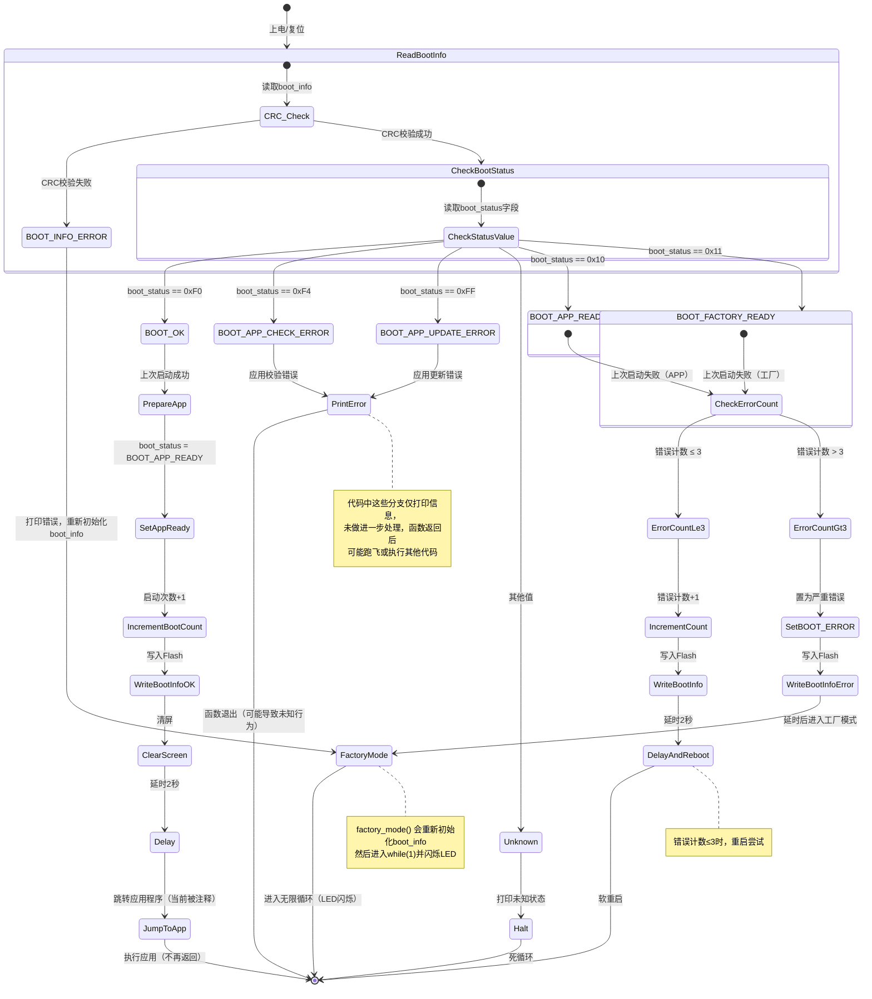

一、 内存分配
    AXI SRAM:
    |内存区域 (AXI SRAM)|用途预估大小|备注
    |0x24000000|LVGL 帧缓冲区1|261 KB|LTDC图层1直接指向此地址
    |0x24041400|LVGL 帧缓冲区2|261 KB|用于双缓冲或图层2
    |0x24082800|LVGL 绘图缓冲区|80 KB|用于实时渲染，大小可调
    |0x24096800|LVGL 对象与数据|剩余空间|存储控件、样式等
    |0x240FFFFF|结束地址|1MB总空间	
二、状态机流程
